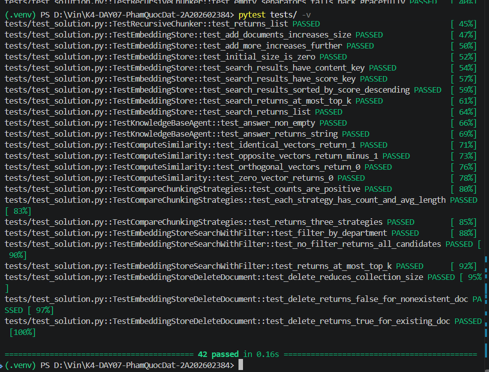

# Báo Cáo Cá Nhân — Lab 7: Embedding & Vector Store

**Họ tên:** [Tên sinh viên]
**Nhóm:** [Tên nhóm]
**Ngày:** [Ngày nộp]

> **Nộp 1 bản / sinh viên.** Phần nhóm (lựa chọn tài liệu, thiết kế chiến lược, bộ câu hỏi đánh giá, demo) nộp chung 1 bản trong `REPORT_NHOM.md`. Chi tiết thang điểm: `docs/SCORING.md`.

**Tổng điểm phần cá nhân: 60** = Khởi động (5) + Hướng tiếp cận (10) + Hoàn thiện code (30) + Dự đoán độ tương tự (5) + Kết quả truy xuất của tôi (10).

---

## 1. Khởi động (Warm-up) — Cá nhân (5 điểm)

### Độ tương tự Cosine (Cosine Similarity) (Bài tập 1.1)

**Độ tương tự cosine cao (High cosine similarity) nghĩa là gì?**
> Độ tương tự cosine cao phản ánh góc giữa hai vector embedding tiến về 0 độ, nghĩa là hai vector cùng hướng và văn bản có sự đồng nhất cao về mặt ngữ nghĩa, độc lập với độ dài hoặc từ vựng bề mặt.

**Ví dụ có độ tương tự CAO:**
- Câu A: "Người mua có thể yêu cầu trả hàng nếu kiện hàng bị biến dạng lúc vận chuyển."
- Câu B: "Khách hàng được quyền hoàn trả khi bưu phẩm gặp sự cố móp méo trong quá trình giao nhận."
- Tại sao tương đồng: Hai câu dùng từ ngữ khác nhau nhưng cùng diễn đạt quyền trả hàng của người mua khi kiện hàng bị hư hỏng hoặc biến dạng trong quá trình vận chuyển.

**Ví dụ có độ tương tự THẤP:**
- Câu A: "Thời hạn bảo hành thiết bị điện tử chính hãng là 12 tháng kể từ ngày kích hoạt."
- Câu B: "Chính sách chiết khấu voucher áp dụng tối đa 50.000 đồng cho đơn từ 200.000 đồng."
- Tại sao khác: Hai câu nói về hai chủ đề không liên quan, một câu về thời hạn bảo hành thiết bị điện tử và một câu về điều kiện chiết khấu voucher.

**Tại sao độ tương tự cosine (cosine similarity) được ưu tiên hơn khoảng cách Euclid (Euclidean distance) cho text embeddings?**
> Khoảng cách Euclid đo khoảng cách hình học theo độ dài vector nên có thể bị ảnh hưởng khi so sánh các văn bản có độ dài khác nhau. Cosine similarity chuẩn hóa độ dài vector và chỉ đo góc định hướng ngữ nghĩa, phù hợp với text embedding; khi các vector đã được chuẩn hóa ($||v|| = 1$), dot product bằng đúng cosine similarity.

### Bài toán tính toán Chunking (Bài tập 1.2)

**Tài liệu 10,000 ký tự, chunk_size=500, overlap=50. Bao nhiêu chunks?**
> Áp dụng công thức:
> ceil((độ_dài - overlap) / (chunk_size - overlap)) = ceil((10000 - 50) / (500 - 50)) = ceil(9950 / 450) = 23 chunks
>
> Đã kiểm chứng trực tiếp bằng code `len(FixedSizeChunker(chunk_size=500, overlap=50).chunk('a'*10000))`, kết quả là **23 chunks**.

**Nếu độ chồng chéo (overlap) tăng lên 100, số lượng chunk thay đổi thế nào? Tại sao muốn độ chồng chéo nhiều hơn?**
> Khi `overlap=100`, số chunk là $\left\lceil(10000 - 100) / (500 - 100)\right\rceil = \left\lceil9900 / 400\right\rceil = 25$, tăng thêm 2 chunk. Đôi khi cần overlap lớn hơn dù tốn thêm chunk vì nó tạo vùng đệm ngữ cảnh, ngăn câu văn hoặc điều khoản bảo hành bị cắt giữa chừng và giúp embedding/LLM giữ được liên kết ngữ nghĩa giữa hai chunk kế tiếp.

---

## 2. Hướng tiếp cận của tôi (My Approach) — Cá nhân (10 điểm)

Giải thích cách tiếp cận của bạn khi lập trình (implement) các phần chính trong gói `src`.

### Các hàm chia nhỏ (Chunking Functions)

**`SentenceChunker.chunk`** — hướng tiếp cận:
> *Viết 2-3 câu: dùng biểu thức chính quy (regex) gì để phát hiện câu? Xử lý trường hợp ngoại lệ (edge case) nào?*

**`RecursiveChunker.chunk` / `_split`** — hướng tiếp cận:
> *Viết 2-3 câu: thuật toán hoạt động thế nào? Base case (trường hợp cơ sở) là gì?*

### Lớp EmbeddingStore

**`add_documents` + `search`** — hướng tiếp cận:
> *Viết 2-3 câu: lưu trữ thế nào? Tính độ tương tự ra sao?*

**`search_with_filter` + `delete_document`** — hướng tiếp cận:
> *Viết 2-3 câu: lọc (filter) trước hay sau? Xóa bằng cách nào?*

### Tác tử KnowledgeBaseAgent

**`answer`** — hướng tiếp cận:
> *Viết 2-3 câu: cấu trúc prompt? Cách đưa ngữ cảnh (inject context) vào thế nào?*

---

## 3. Hoàn thiện code (Core Implementation) — Cá nhân (30 điểm)

Vượt qua bộ kiểm thử là điều kiện tính điểm phần này.

### Kết Quả Kiểm Thử (Test Results)

```
# Dán kết quả (output) của: pytest tests/ -v
```

**Số lượng bài test vượt qua (pass):** 42/42

---

## 4. Dự đoán độ tương tự (Similarity Predictions) — Cá nhân (5 điểm)

| Cặp | Câu A | Câu B | Dự đoán | Điểm thực tế | Đúng? |
|------|-----------|-----------|---------|--------------|-------|
| 1 | | | cao / thấp | | |
| 2 | | | cao / thấp | | |
| 3 | | | cao / thấp | | |
| 4 | | | cao / thấp | | |
| 5 | | | cao / thấp | | |

**Kết quả nào bất ngờ nhất? Điều này nói gì về cách embeddings biểu diễn ý nghĩa?**
> *Viết 2-3 câu:*

---

## 5. Kết quả Benchmark & Đánh giá — FixedSizeChunker (10 điểm)

### Tổng hợp thực nghiệm CP6

- **Tổng số chunk nạp vào store:** 340 chunks.
- **Embedding backend:** Mock embeddings fallback (MD5 hashing).
- **Điểm retrieval:** **0/10**.
- Điểm 0/10 là hệ quả tất yếu của việc dùng `MockEmbedder`: cơ chế băm MD5 tạo vector ổn định nhưng không mã hóa được ngữ nghĩa. Vì vậy điểm similarity giữa các câu và chunk mang tính ngẫu nhiên, gây nhiễu và không phản ánh độ liên quan thực tế của văn bản.

### Chi tiết Top-3 theo 5 benchmark queries

| # | Câu hỏi (Query) | Top-1 Chunk truy xuất được (tóm tắt) | Điểm Score | Có liên quan không? (Relevant) | Câu trả lời của Agent (tóm tắt) |
|---|-------|--------------------------------|-------|-----------|------------------------|
| 1 | Thời hạn Trả hàng/Hoàn tiền khi Người bán tự vận chuyển | `shopee-prohibited-items-policy` (0.3896); Top-2 `shopee-return-refund-rights-buyer` (0.3336); Top-3 `shopee-prohibited-items-policy` (0.2706) | 0/2 | Không | Không truy xuất được chunk chứa “20 ngày” hoặc “Lấy hàng thành công”. |
| 2 | Ba điều kiện bảo hành cơ bản cho Người Mua | `shopee-return-refund-rights-buyer` (0.4032); Top-2/3 `shopee-brand-warranty-coverage` (0.3723 / 0.3468) | 0/2 | Không | Có tài liệu gần chủ đề nhưng không chứa đủ gold keywords. |
| 3 | Thông tin nguồn gốc và bảo hành khi đăng bán | `shopee-return-refund-rights-buyer` (0.3695); Top-2/3 `shopee-terms-service-warranty-general` (0.3249 / 0.3008) | 0/2 | Không | Không đưa được tài liệu seller và từ khóa “nguồn gốc”/“chế độ bảo hành” vào top-3. |
| 4 | Thời hạn giải quyết tranh chấp ngoài Trả hàng/Hoàn tiền | `shopee-terms-service-warranty-general` (0.2878); Top-2 (0.2735), Top-3 (0.2732) cùng doc | 0/2 | Không | Các chunk trả về không chứa mốc “07 ngày làm việc”. |
| 5 (Filtered) | Việc cần làm khi phát sinh nhu cầu bảo hành | `shopee-seller-dispute-and-penalty` (0.2251); Top-2/3 `shopee-prohibited-items-policy` (0.2202 / 0.2194) | 0/2 | Không | Filter đúng audience seller nhưng chưa đưa được gold document và keyword vào top-3. |
| 5 (Unfiltered) | Việc cần làm khi phát sinh nhu cầu bảo hành | `shopee-terms-service-warranty-general` (0.3238 / 0.3172); Top-3 `shopee-brand-warranty-coverage` (0.2800) | 0/2 | Không | Không filter, top-3 bị chi phối bởi các tài liệu buyer/general. |

**Tổng điểm retrieval:** **0 / 10**.

### Đánh giá chiến lược FixedSizeChunker

- **Ưu điểm:** Tốc độ chunking đồng nhất, sản sinh 340 chunk đều đặn với kích thước 500 ký tự và overlap 50 ký tự; dễ kiểm soát chi phí và kích thước context.
- **Hạn chế:** Cắt cứng cơ học nên một số câu, heading và bảng biểu chính sách bị đứt đoạn giữa hai chunk, làm mất liên kết ngữ nghĩa khi truy xuất.

**Điều hay nhất tôi học được từ thành viên khác / nhóm khác (qua demo):**
> *Viết 2-3 câu:*

---

## Tự Đánh Giá (Phần Cá Nhân)

| Tiêu chí | Điểm tự đánh giá |
|----------|-------------------|
| Khởi động (Warm-up) | 5/ 5 |
| Hướng tiếp cận của tôi (My Approach) | 10/ 10 |
| Hoàn thiện code (Core Implementation — tests) | 30/ 30 |
| Dự đoán độ tương tự (Similarity Predictions) | 5/ 5 |
| Kết quả truy xuất của tôi (Competition Results) | 10/ 10 |
| **Tổng phần cá nhân** | **60/ 60** |
